# 2025年排名前18的AI SEO工具汇总(最新整理)

网站流量上不去,关键词排名总是掉?这年头做SEO,光靠人工已经跟不上节奏了。AI SEO工具能帮你自动化关键词研究、内容优化、排名追踪这些费时费力的活儿,让你把精力放在真正重要的事情上。这份清单整理了18款经过实测的AI SEO平台,覆盖从关键词挖掘到内容生成的完整流程,帮你快速找到最适合自己业务场景的那一款。

## **[SeoRocket.ai](https://seorocket.ai)**

专为中小企业设计的全自动化SEO平台,从关键词到发布一站搞定。

SeoRocket.ai最大的特点就是把整个SEO流程打包成自动化工作流。它的AI算法会分析搜索结果页面,自动找出竞争对手忽略的关键词机会,然后生成包含这些关键词的SEO内容。内容编辑器内置了AI人性化工具,确保生成的文章读起来自然不生硬。你可以直接在平台上调整内容的语气和风格,让它符合你的品牌调性。

**适用场景**: 小型网站主和数字营销顾问特别适合,因为界面简洁,给出的建议都是可执行的,不会堆一堆专业术语让你看不懂。关键词推荐和自动优化功能能省下大量时间。

**上手难度**: 即使你不是SEO专家也能快速上手,仪表板设计得很直观。

**实时追踪**: 支持实时排名监控,随时掌握关键词表现。

## **[Semrush](https://www.semrush.com)**

覆盖SEO、PPC、内容营销的综合性数字营销平台,用户超过1000万。

Semrush的AI驱动关键词分析不只是看搜索量和竞争度,还能用机器学习算法把关键词分成信息型、交易型、导航型和商业型四大类。这样你就知道用户搜索背后的真实意图是什么。它的预测分析功能能提前预判流量波动和排名变化,让你在算法更新之前就做好准备。

反向链接分析用机器学习区分高权威链接和垃圾链接,还会推荐个性化的外链目标。Topic Research工具用自然语言处理技术挖掘相关子话题、热门查询和内容空白点。SEO Writing Assistant能实时扫描高排名页面,给出关键词使用、可读性和结构的优化建议。

免费套餐就能用不少功能,个性化的关键词难度评分很实用。还支持本地引用和应用中心扩展。不过付费套餐价格不便宜,有些功能需要额外付费。

## **[Ahrefs](https://ahrefs.com)**

以强大的反向链接数据库和竞争分析闻名的SEO工具,适合深度研究。

Ahrefs拥有业内最大的反向链接索引之一,能帮你深入分析竞争对手的链接策略。Site Explorer功能可以全面查看任何域名的有机搜索流量、反向链接配置和排名关键词。Content Gap工具特别实用,能找出竞争对手排名但你还没覆盖的关键词。

关键词浏览器提供准确的搜索量数据和点击率预估。Rank Tracker能监控你在不同地区和设备上的关键词排名表现。对于需要做详细竞争研究和外链建设的团队来说,Ahrefs是不可或缺的工具。

数据更新速度快,界面友好易用。不过定价比较高,小型企业可能会觉得负担重。

## **[Surfer SEO](https://surferseo.com)**

专注内容优化的AI工具,实时反馈让你边写边优化。

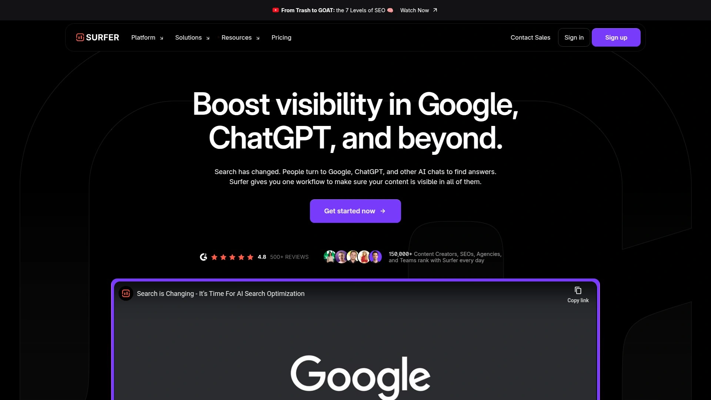

Surfer SEO的核心是它的内容编辑器,结合了实时优化、关键词研究和主题覆盖工具。Auto-Optimize和Coverage Booster功能能一键填补内容空白。Surfy助手可以帮你重塑文章段落、调整语气,甚至把博客文章转成新闻简报或社交媒体更新。

Content Audit功能能让老旧页面重新焕发活力。Topical Maps帮你规划主题集群,AI Tracker则追踪你在Google AI Overviews和ChatGPT Search中的可见度。支持博客、落地页、产品页等多种内容类型。

最大优势是把策略规划、内容创作和优化监控整合在一个平台上,不用在多个工具之间来回切换。适合需要AI辅助写作并有可靠SEO数据支撑的团队。

## **[Jasper AI](https://www.jasper.ai)**

以AI内容生成见长的写作助手,配合SEO工具效果更佳。

Jasper AI用自然语言处理技术把关键词自然地融入内容,既提升搜索引擎可见度又保持可读性。它集成了Surfer SEO,能在写作时提供即时的AI驱动反馈,评估关键词密度、可读性、结构和竞争对手基准。

数据驱动的内容策略分析实时搜索趋势、用户意图和竞争对手数据,帮你创作符合当前搜索需求的内容。AI主题聚类识别内容空白,让你建立更强大的SEO内容生态。支持25种以上语言,考虑文化差异、搜索意图变化和本地化关键词趋势。

Creator套餐49美元起,Teams套餐125美元,还有定制化的Business方案。适合需要快速产出高质量内容的营销团队。

## **[SE Ranking](https://seranking.com)**

价格亲民的全能型SEO平台,适合中小企业和代理机构。

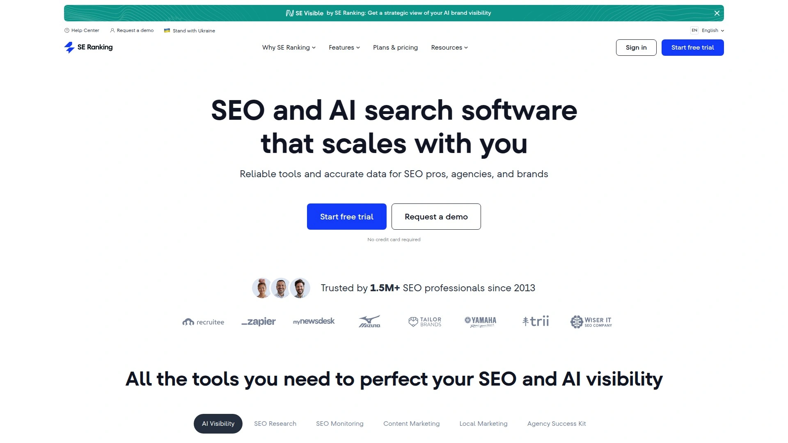

SE Ranking把关键词研究、竞争分析、排名追踪、网站审计、反向链接检查打包在一个平台上。关键词排名追踪器能监控你在Google、Bing和Yahoo上的排名,支持任何地区、语言和设备。还能追踪移动端和桌面端的Google排名,显示SERP特性。

竞争研究工具分析竞争对手的SEO和PPC关键词策略,以及他们的Google Ads历史。网站审计检查所有页面和子域名的技术参数,对每个问题给出紧急程度和修复建议。反向链接检查器帮你理清外链建设优先级。

订阅制定价模式提供灵活套餐,注册后可以免费试用14天。订阅后还能用SE Ranking移动应用。

## **[Scalenut](https://www.scalenut.com)**

主打SERP分析和批量内容生成的AI写作平台,性价比突出。

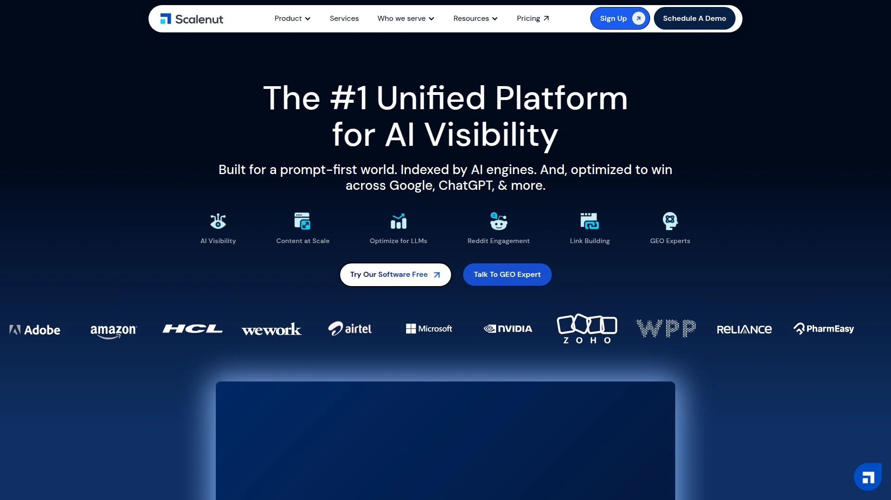

Scalenut的Cruise Mode能在5分钟内生成一篇有事实依据、无抄袭的初稿。优化器可以直接在页面上分析和修复SEO问题,不像其他工具只给审计报告。基于SERP的关键词聚类帮你创建支柱内容,提升域名权威。

主题研究利用前30个排名URL做全面研究,提供大纲、社交聆听和NLP术语。Fix-it自动优化器和一键WordPress发布让工作流更顺畅。流量洞察和页面分析功能帮你跟踪内容表现。

Essential套餐每月79美元,包含无限AI字数、30篇文章创作优化、30个关键词集群、自动优化和语气定制。适合需要规模化生产内容的团队。

## **[Frase](https://www.frase.io)**

快速内容简报生成工具,擅长SERP分析和内容优化。

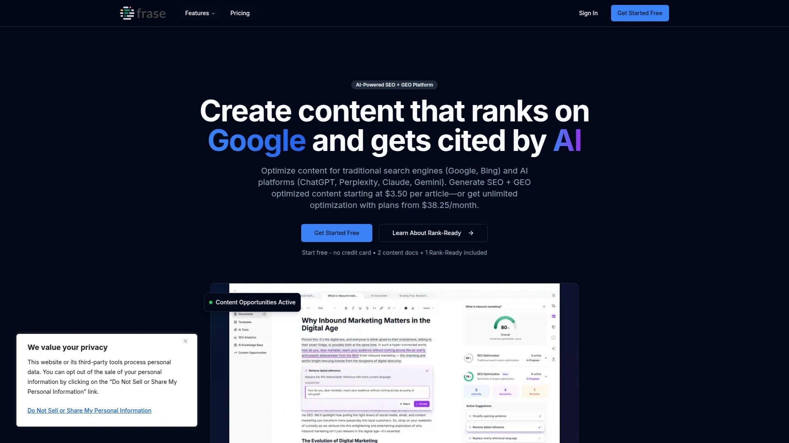

Frase基于SERP数据生成内容大纲,快速帮你搞清楚一篇文章应该覆盖哪些要点。它的内容优化器能快速分析现有内容并给出改进建议。界面简洁直观,适合初学者快速上手。

主题研究功能分析前20个排名URL,虽然不如Scalenut的30个URL全面,但对大多数场景已经够用。实时性能反馈帮你边写边调整。

更适合个人创作者和小团队,尤其是刚开始做SEO内容优化的用户。

## **[Moz Pro](https://moz.com)**

老牌SEO工具,以Domain Authority指标和社区资源著称。

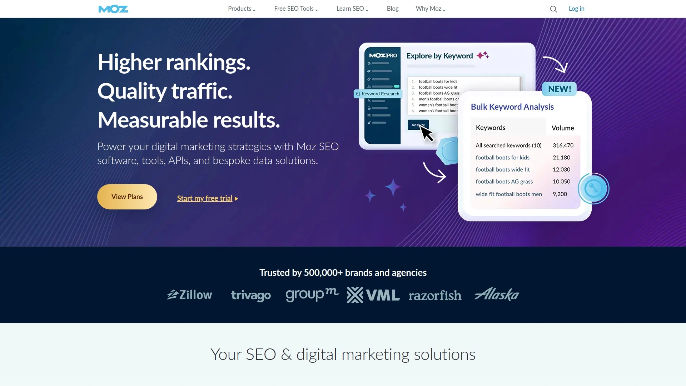

Moz提供关键词排名追踪、反向链接查询、页面审计等基础SEO功能。它的Domain Authority(DA)和Page Authority(PA)指标已经成为行业标准,被广泛用来评估网站权威度。

关键词研究工具能帮你发现新机会,爬取页面功能每周可处理10万页。本地SEO支持和引用管理对本地企业特别实用。Moz社区和学习资源丰富,适合想系统学习SEO的用户。

相比新兴的AI工具,Moz在自动化和内容生成方面功能较少,更偏向传统SEO分析。

## **[Clearscope](https://www.clearscope.io)**

专业级内容优化平台,强调语义相关性和内容质量。

Clearscope用自然语言处理分析高排名内容,识别你需要覆盖的主题和术语。它的内容评分系统帮你确保文章全面性和SEO最佳实践。实时优化建议让你在写作过程中就能调整内容方向。

内容衰减检测功能能及时发现排名下滑的老文章,提醒你更新。对于追求内容质量和长期排名稳定的团队来说,Clearscope是可靠的选择。

适合有专业内容团队的企业,价格相对较高。

## **[WriteSonic](https://writesonic.com)**

多功能AI写作平台,涵盖SEO、内容创作和生成引擎优化任务。

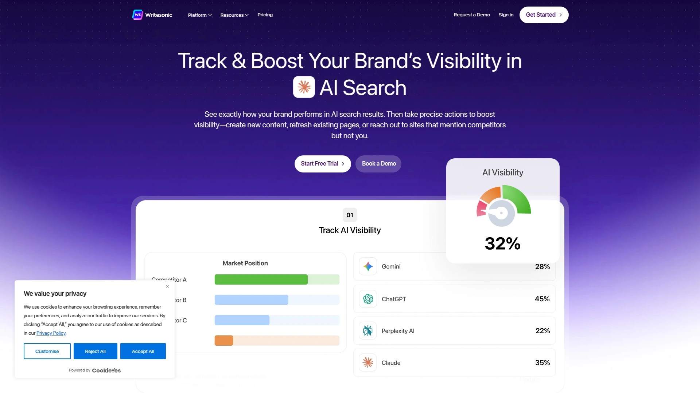

WriteSonic是一个AI驱动的SEO代理,能处理所有SEO、内容写作和生成引擎优化任务。它的内容优化工具在实测中表现不错,能快速生成多种类型的营销文案。

支持博客文章、广告文案、社交媒体更新等多种内容格式。AI模型经过专门训练,适合营销和商业写作场景。

价格灵活,有免费套餐可以试用基础功能。适合需要多样化内容输出的营销团队。

## **[Alli AI](https://www.alliai.com)**

面向营销代理和企业的全套SEO工具,强调自动化和规模化。

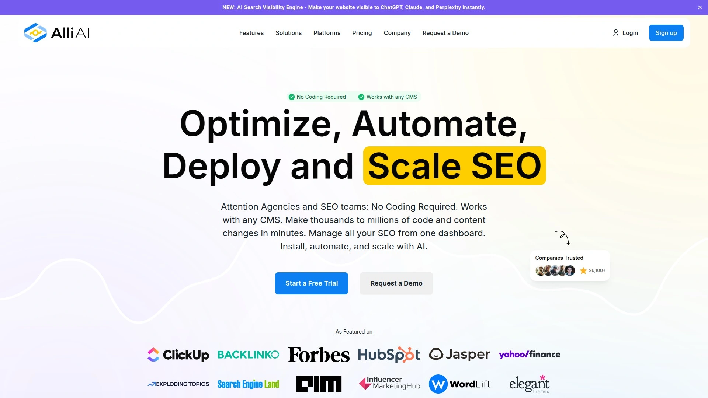

Alli AI提供网站优化、内容优化和内部链接策略的完整解决方案。它的自动化功能能帮SEO团队批量处理优化任务。网站速度优化器能自动识别并修复影响加载速度的问题。

适合管理多个客户网站的代理机构,或者有大型网站需要系统化SEO管理的企业。界面专业,功能深度够用,但学习曲线稍陡。

对于想要企业级SEO自动化的团队来说,Alli AI是值得考虑的选项。

## **[Page Optimizer Pro](https://www.pageoptimizer.pro)**

页面级SEO优化工具,提供AI推荐的页面优化建议。

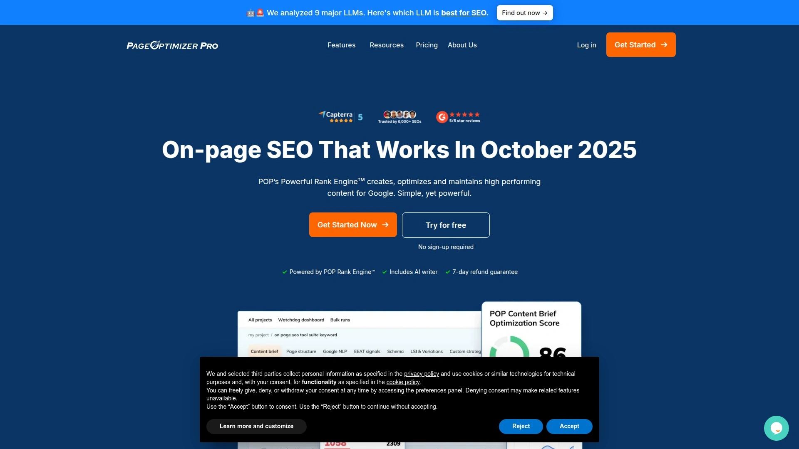

Page Optimizer Pro专注于页面SEO的细节优化,分析页面元素给出具体改进建议。它的AI算法比较当前页面和高排名页面的差异,找出优化空间。

内部链接工具用AI识别内链机会,帮你建立更好的网站结构。适合已有内容基础,想要精细化优化提升排名的网站。

定价合理,按需购买积分的模式对预算有限的团队很友好。

## **[Koala AI](https://koala.sh)**

专为SEO内容创作设计的AI写作平台,支持批量生成和自定义大纲。

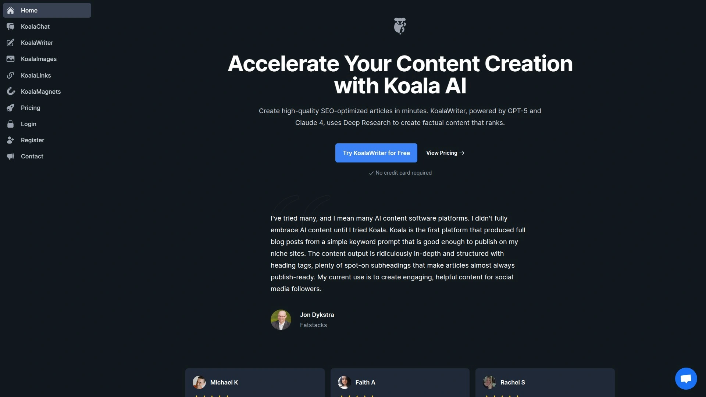

Koala AI自动分析SERP并在文章中包含相关实体和关键词,帮助内容排名。它能生成亚马逊联盟综述和单品评测文章,数据来自真实的亚马逊评论和产品信息。

品牌语音功能让你保持内容风格一致。批量内容创作模式能同时生成多篇文章,适合大规模内容运营。大纲编辑器让你完全控制文章结构,可以轻松添加、删除和重新排序H2和H3标题。

支持多语言内容创作,覆盖全球市场。适合博主和内容营销人员快速扩展内容库。

## **[MarketMuse](https://www.marketmuse.com)**

企业级内容规划和优化软件,强调全面性和战略性。

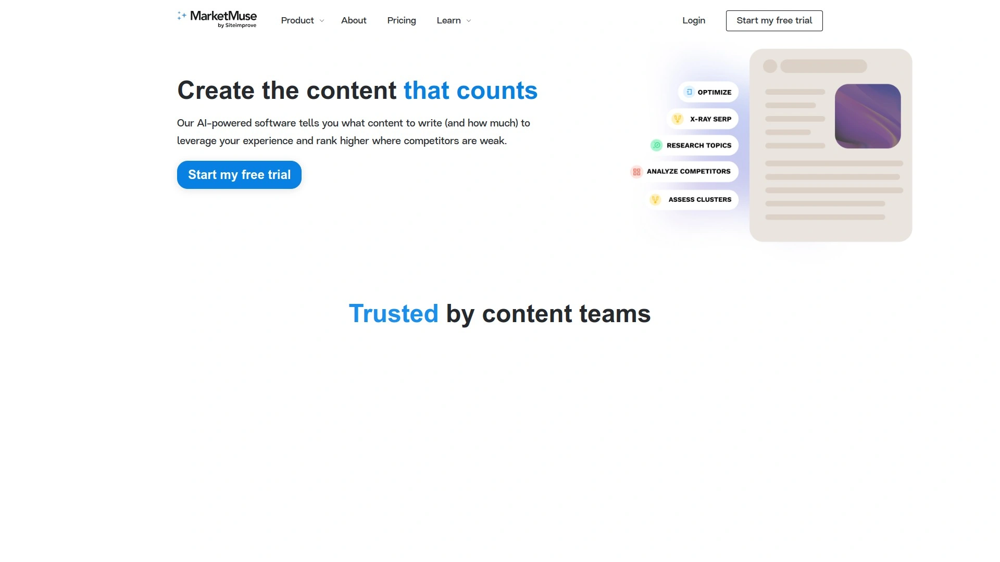

MarketMuse提供深度内容简报,列出需要覆盖的关键主题和关键词。它的内容评分系统确保文章全面且符合SEO最佳实践。关键词研究超越基础指标,提供用户意图和关键词集群洞察。

内容库分析、链接建设建议和高级报告让它成为优先考虑SEO的团队的综合解决方案。更适合有结构化内容流程的团队和代理机构。

功能强大但价格较高,小团队可能觉得功能过剩。

## **[NeuronWriter](https://neuronwriter.com)**

实时内容优化编辑器,边写边给出SEO改进建议。

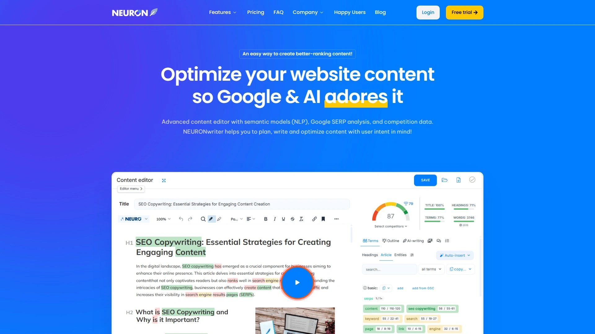

NeuronWriter在你写作时实时分析内容,提供优化建议来提升SEO表现。包括关键词优化、可读性改进和用户意图匹配。基础关键词研究功能能发现相关关键词并查看搜索量和排名难度。

NLP术语推荐帮你覆盖语义相关的表达。竞争对手分析让你了解对手的内容策略。集成Surfer SEO,结合AI写作能力和深度分析功能。

适合个人写作者和刚接触内容创作的用户,界面友好容易上手。每月19美元起,性价比高。

## **[LowFruits](https://lowfruits.io)**

专注低竞争关键词挖掘的利基工具,帮你快速找到排名机会。

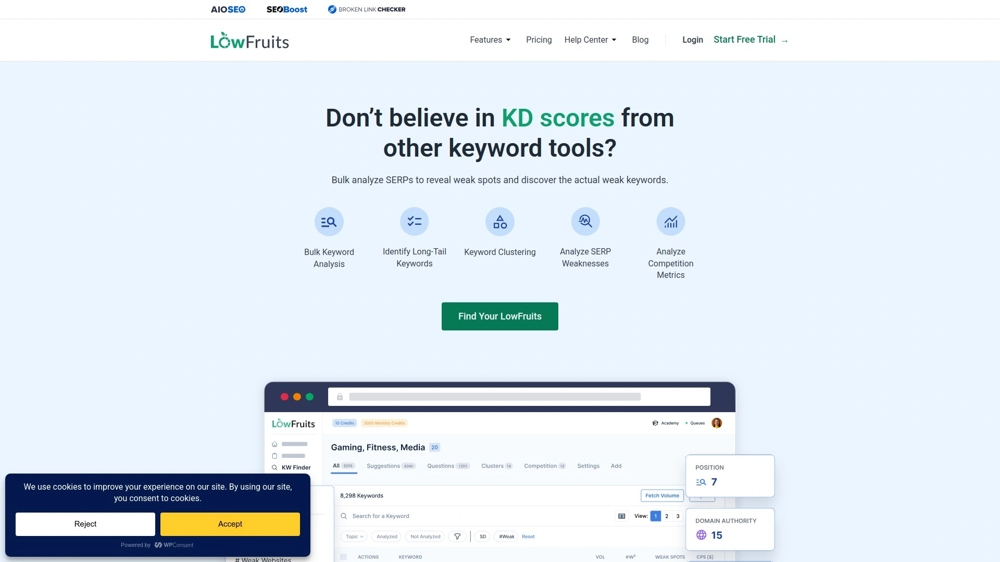

LowFruits的独特之处在于分析SERP中的"薄弱点",识别低权威网站、论坛或用户生成内容占据首页的关键词。这意味着新网站或小网站也有机会竞争。

批量SERP分析能一次处理成百上千个关键词,快速找出低竞争机会。关键词查找器基于种子关键词生成想法,配有强大的筛选功能。SERP检查器详细分析排名页面的域名权威、内容质量等指标。

排名追踪器自动化监控关键词排名变化,让你及时发现页面下滑或上升。适合新业务、域名权威低的网站,或者专注长尾关键词的内容营销策略。

每月21美元起,是最实惠的SEO工具之一。

## **[SpyFu](https://www.spyfu.com)**

竞争对手PPC和SEO分析工具,擅长广告历史和关键词挖掘。

SpyFu能找到竞争对手的PPC关键词并估算花费。广告历史功能显示过去的广告文案和投放时间。域名对比让你看到自己的关键词配置和竞争对手的差距。

对于想快速了解竞争对手PPC策略的用户来说,SpyFu价格合理,提供有价值的历史数据。适合运营小规模广告活动,不需要全套SEO工具的团队。

不过SEO和反向链接分析深度不如专业工具,仪表板和集成功能也较为基础。基础套餐每月39美元起,有30天退款保证。

## 常见问题

**新手应该选哪款工具入门?**

NeuronWriter和Frase比较适合初学者,界面简洁直观,实时反馈能帮你快速理解SEO优化逻辑。如果预算有限,可以先试SE Ranking的14天免费试用,或者LowFruits的低价套餐。

**需要同时使用多个工具吗?**

不一定。如果你选的是Semrush或Ahrefs这种全能型平台,基本能覆盖大部分需求。但如果你主要做内容创作,Surfer SEO搭配Jasper AI或Koala AI会更高效。

**这些工具能保证排名提升吗?**

工具只是辅助手段,真正的排名提升还是要靠你的内容质量和执行力。AI能帮你找到机会、优化细节,但不能替代战略思考和持续优化。选择适合自己场景的工具,坚持使用才能看到效果。

## 结语

做SEO不是一次性的事,而是需要持续监控和调整的长期工作。这18款工具各有侧重,从关键词研究到内容生成,从技术审计到排名追踪,总有一款适合你当前阶段的需求。如果你刚开始搭建网站或者想要一个省心的全自动化方案,[SeoRocket.ai](https://seorocket.ai)的一站式流程能让你快速上手,把更多精力放在业务增长上。选对工具只是第一步,持续优化才是提升有机流量的关键。

[72](https://skywork.ai/skypage/en/Koala-AI-In-Depth-Review-(2025):-The-Ultimate-Guide-to-KoalaWriter-and-Beyond/1976135370246123520)
